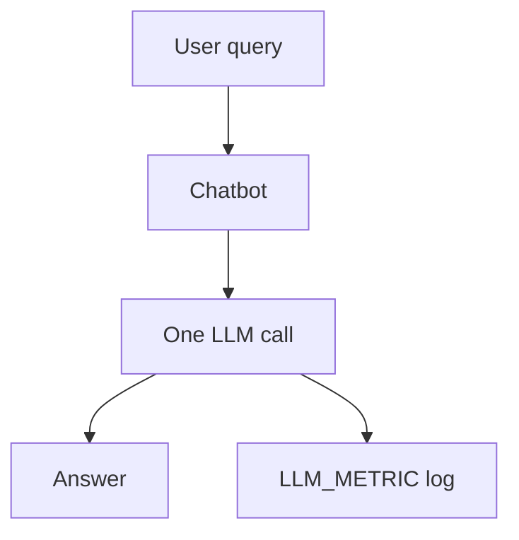
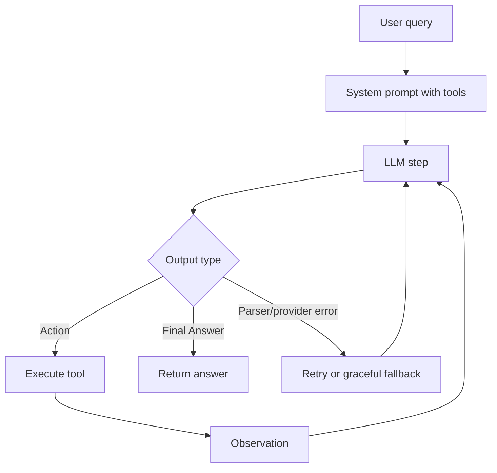

# Group Report: Lab 3 - Chatbot vs ReAct Agent

- **Team Name**: Solo - Kieu Duc Long
- **Team Members**: Kieu Duc Long
- **Student ID**: 2A202600939
- **Deployment Date**: 2026-06-01

## 1. Executive Summary

This project implements a Smart E-commerce Assistant and compares three systems:

- baseline chatbot;
- Agent v1 with a ReAct loop;
- Agent v2 with parser validation, retry, provider error handling, and repeated-action guardrails.

Primary provider is MiMo with `mimo-v2.5-pro`. Secondary provider comparison was completed with Gemini using `gemini-3.1-flash-lite`.

Key outcomes:

- Agent v1 successfully used real tools and produced a correct multi-step order total.
- Agent v1 produced real failure traces, including provider rate-limit crash and hallucinated model-written observations.
- Agent v2 mitigated those failures with retry, graceful provider-error handling, stricter parsing, and validation.
- Deterministic validators were used for benchmark scoring; no LLM-as-a-judge scoring was used.

## 2. System Architecture and Tooling

### 2.1 Chatbot Flow



The chatbot baseline calls the LLM exactly once and does not call tools. It is useful for simple Q&A, but it can hallucinate e-commerce facts in multi-step tasks.

### 2.2 ReAct Agent Flow



Agent v1 implements the basic loop. Agent v2 adds:

- strict single-action parsing;
- markdown-fenced JSON support;
- rejection of model-written `Observation`;
- argument validation;
- provider error retry;
- repeated-action detection;
- controlled termination reason.

### 2.3 Tool Inventory

| Tool | Input | Use Case |
| --- | --- | --- |
| `search_products` | `query`, `category`, `max_price` | Search catalog |
| `get_product_details` | `item_name` | Get price, stock, weight |
| `check_stock` | `item_name`, `requested_quantity` | Confirm availability |
| `get_discount` | `coupon_code` | Validate active/expired/unknown coupon |
| `calc_shipping` | `weight_kg`, `destination` | Calculate shipping fee |
| `calculate_order_total` | `unit_price`, `quantity`, `discount_percent`, `shipping_fee` | Compute final total |

### 2.4 Providers Used

| Role | Provider | Model | Evidence |
| --- | --- | --- | --- |
| Primary | MiMo | `mimo-v2.5-pro` | Agent v1/v2 traces, main demo |
| Secondary | Gemini | `gemini-3.1-flash-lite` | 5-case provider comparison |
| Optional | Local | GGUF config placeholder | Not used for final evidence |

## 3. Telemetry and Performance Dashboard

Structured JSON logs are written under `logs/`.

Important event types:

- `CHATBOT_START`, `CHATBOT_END`
- `AGENT_START`, `AGENT_STEP`, `AGENT_END`
- `LLM_METRIC`
- `TOOL_CALL`, `TOOL_RESULT`
- `PARSER_ERROR`, `PROVIDER_ERROR`, `RETRY`, `REPEATED_ACTION`
- `FINAL_ANSWER`, `MAX_STEPS_EXCEEDED`

MiMo Token Plan policy:

```json
{
  "cost_estimate": null,
  "cost_note": "N/A: token-plan quota"
}
```

### 3.1 Main MiMo Benchmark

Source: `evaluation/results/summary.md`

| Mode | Provider | Case | Passed | Success Rate | Avg Tokens | Avg Latency ms |
| --- | --- | --- | ---: | ---: | ---: | ---: |
| agent-v2 | mimo | B11 full_order | 1/1 | 100.0% | 5755 | 49445 |

This run verifies the full-order Agent v2 path with deterministic validation, CSV export, Markdown summary, token tracking, and tool-sequence evidence.

### 3.2 Secondary Provider Comparison

Source: `evaluation/results/provider_comparison.md`

| Mode | Provider | Cases | Skipped | Passed | Success Rate | Avg Tokens | Avg Latency ms |
| --- | --- | ---: | ---: | ---: | ---: | ---: | ---: |
| agent-v2 | gemini | 5 | 0 | 5 | 100.0% | 1190 | 1414 |

Representative cases:

- product details;
- stock;
- coupon;
- shipping Hanoi;
- search products.

## 4. Success Trace

Trace file:

```text
report/evidence/traces/success_trace_multi_step.md
```

Query:

```text
I want to buy 2 iPhone 15 devices using code WINNER and ship to Hanoi. What is the final total?
```

Expected deterministic calculation:

```text
2 * 20,000,000 = 40,000,000
10% discount = 4,000,000
shipping 0.7 kg to Hanoi = 37,000
final total = 36,037,000 VND
```

Observed final answer:

```text
36,037,000 VND
```

Tool sequence included product lookup, coupon lookup, stock/shipping checks, and total calculation.

## 5. Root Cause Analysis - Failure Traces

### 5.1 Provider Rate-limit Crash in Agent v1

Trace:

```text
report/evidence/traces/failure_trace_provider_rate_limit.md
```

Symptom:

```text
openai.RateLimitError: Error code: 429 - Too many requests
```

Root cause:

- Agent v1 called `llm.generate` without catching provider exceptions.
- The process crashed before writing `AGENT_END`.
- Benchmark/live demo could fail from a temporary provider limitation.

Agent v2 fix:

- catch provider exceptions;
- log `PROVIDER_ERROR`;
- retry up to `max_retries`;
- return a graceful fallback;
- always log `AGENT_END`.

Evidence:

```text
report/evidence/traces/agent_v2_fix_trace.md
```

### 5.2 Hallucinated Observation Near-miss

Trace:

```text
report/evidence/traces/failure_trace_hallucinated_observation_atlantis.md
```

Symptom:

- MiMo wrote its own `Observation` values before the runtime executed tools.
- Raw model output contained wrong price/stock/weight.
- Real tool output corrected the data.

Root cause:

- ReAct v1 text format allowed mixed action, observation, and final answer in one response.

Agent v2 mitigation:

- reject model-written `Observation`;
- require exactly one action or final answer;
- retry malformed/mixed outputs;
- validate arguments before execution.

## 6. Evaluation Strategy

Business benchmark cases are in:

```text
evaluation/test_cases.json
```

Validators are in:

```text
evaluation/validators.py
```

Each case includes:

- `id`
- `category`
- `query`
- `expected`
- `validator`
- `required_tools`
- `forbidden_tools`

Reliability tests are separate and use fake providers:

- parser errors;
- markdown-fenced JSON;
- model-written observations;
- provider exceptions;
- unknown tools;
- missing/wrong arguments;
- repeated actions.

Current automated test status:

```text
57 passed
```

## 7. Ablation Studies

Prepared configs:

- `evaluation/configs/tool_specs_v1.json`
- `evaluation/configs/tool_specs_v2.json`
- `evaluation/configs/prompt_v1.txt`
- `evaluation/configs/prompt_v2.txt`

Prepared outputs:

- `evaluation/results/ablation_results.csv`
- `evaluation/results/ablation_summary.md`

Status: scaffold prepared, full ablation run pending to avoid unnecessary live API calls after rate-limit events.

## 8. Production Readiness Review

Security:

- `.env` is ignored by Git.
- API keys are not hard-coded.
- Secret scans were run with `git grep -n "tp\\-"` and `git grep -n "sk\\-"`.

Reliability:

- `max_steps` prevents infinite loops.
- Agent v2 catches provider errors and logs controlled termination.
- Deterministic validators replace subjective judging.

Scalability:

- Provider factory supports MiMo, Gemini, OpenAI, and local model.
- Benchmark runner supports mode/provider switching.
- Future production version should add async queues, persistent trace IDs, and backoff based on provider retry delays.

## 9. Demo Commands

```powershell
python main.py --mode chatbot --provider mimo --prompt "What products do you sell?"
python main.py --mode agent-v1 --provider mimo --prompt "I want to buy 2 iPhone 15 devices using code WINNER and ship to Hanoi. What is the final total?"
python main.py --mode agent-v2 --provider mimo --prompt "I want to buy 2 iPhone 15 devices using code WINNER and ship to Hanoi. What is the final total?"
python main.py --mode agent-v2 --provider gemini --prompt "How much is shipping 0.7 kg to Hanoi?"
python evaluation/run_benchmark.py --provider mimo --mode chatbot --case-id B01
```

## 10. Final Status

The lab demonstrates the full path from chatbot baseline to ReAct Agent v1, failure analysis, Agent v2 improvement, deterministic evaluation, and provider switching.
